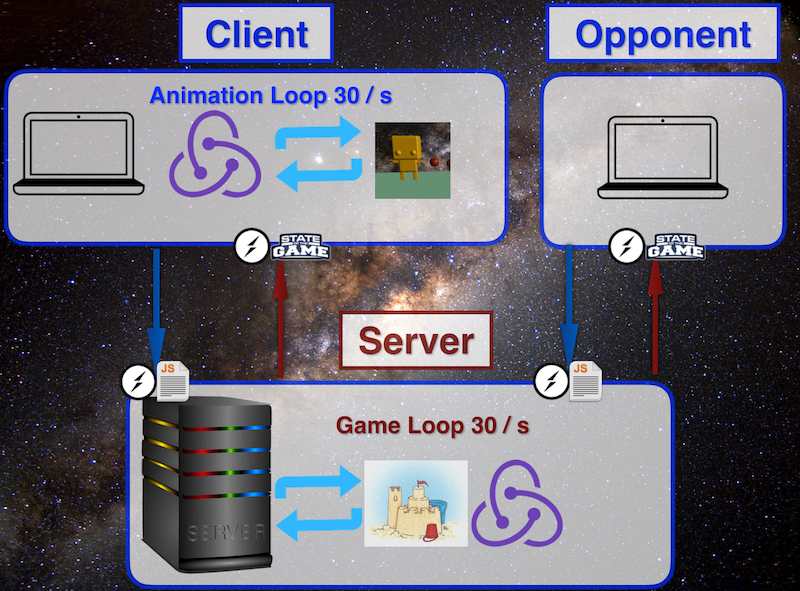

# JellyRobots

## 3D Multiplayer Browser Game

JellyRobots is a 3D-multiplayer browser-based game where players can code robots in Javascript with the help of an API that we've written and provided.
Battle your robots in either multiplayer mode or training mode against one of our default robots.
![]
(https://media.giphy.com/media/o9WlcuZkLDw4g/giphy.gif)

## Watch an overview of our game here.

## Gameplay

After players spend some time coding their robot using their knowledge of Javascript and our docs, it's time to battle.
Our robot API provides a handful of walking, firing, and other helper functions to aid players in creating their ultimate Javascript robot.

## Architecture

Let’s step through a high-level overview of what happens when a user writes code for a robot and then presses submit.

The code editor that users write in is a React component, and when they press Submit, that component’s state is sent to the server via a Socket.IO event.

On the server, we have a game loop that runs 30 times per second and repeatedly evaluates the code that the user has submitted and updates the game state.
Within the game loop, the code is evaluated in a sandbox -- we used Sandcastle -- that prevents this code from damaging or crashing our server.
The sandbox then updates our server-side Redux store, which we use to keep track of the game state for ALL players.
When the game state is broadcasted down to all clients using socket IO, their local redux stores are updated with the most recent state.

This is then used to re-render the appearance of the Three.JS scene which we used as our 3D graphics library.
Now we have a robot who can move and fire projectiles, and who will be continually updated as the server’s game loop sends down updated data.

## Tips & Tricks
* THE DOCS WILL BE YOUR BEST FRIEND!
* For now, you need to make sure each function is called with `(roomName, playerId)` because these are variables defined on our server.
* If you write bad code (incorrect syntax or improper functions), your robot will only `walkForward(roomName, playerId)`.
* Use modulo math along with `incrementCounter(roomName, playerId)` and `getCounter(roomName, playerId)` to set patterns for walking or firing.
* You have the ability to get your opponent's position and health - use this to your advantage!
* Map coordinates of the walls and boxes are provided - this can be helpful in setting your robot's path.

## Conventions

If you want to play locally or modify our game we encourage it!

Fork and clone this repository.

Then install the dependencies

`npm install`
Start webpack

`npm run build-watch`
To start the server

`npm start`
Then go to http://localhost:1337/ and code your JellyRobot!

## Special Thanks and Credits

Thanks to [@FullstackAcademy](https://github.com/FullstackAcademy/) for enabling us to create this project and supporting us throughout!
